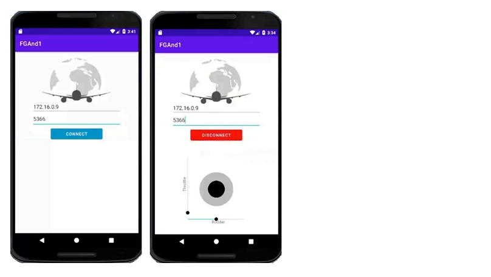
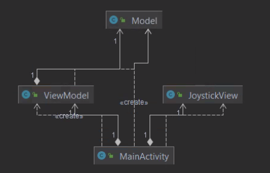

# Android Flight Simulator
### General
In this project, we built a android app with java which is designed in MVVM architecture, that is communicating with the app "FlightGear". 
The app contains a connection part - to the "FlightGear" app with IP and port, and a joystick + seekbars to control the aircraft on the "FlightGear" app.

### Installation
1. Clone the project repository to your computer
2. Run the Flight Gear simulator with the following settings: --telnet=socket,in,10,127.0.0.1,6000,tcp
3. Open the app and write your own IP and 6000 as the port and press connect.
4. Fly and enjoy!

### Repositories structure
- View Model folder - contains the main view model
- Model folder - contains the main model
- View folder - contains the view of the joystick and the main view

### Requirements(for best preformence)
FlightGear version - 2020.3.6

### UML

### Video
[The full video with explanation about the project and the MVVM architecture](Media/video.mp4) need to download before watching.

